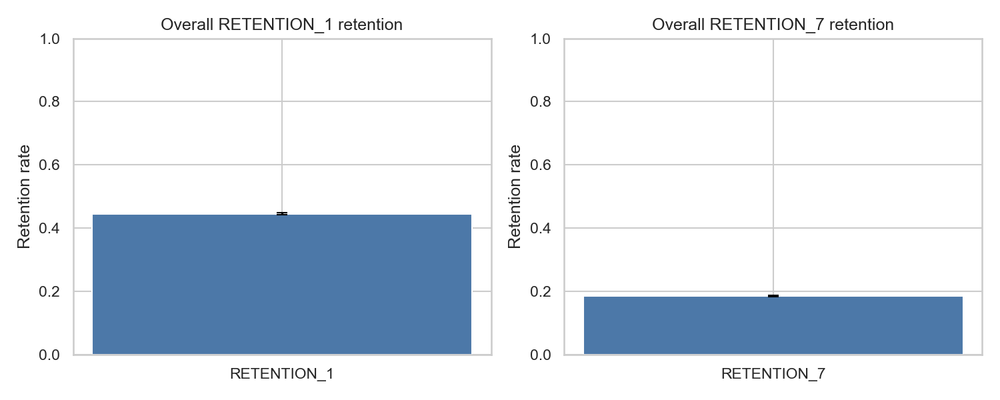
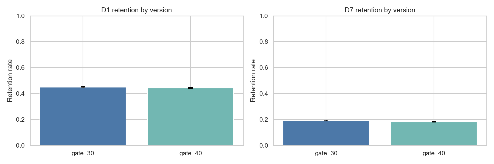
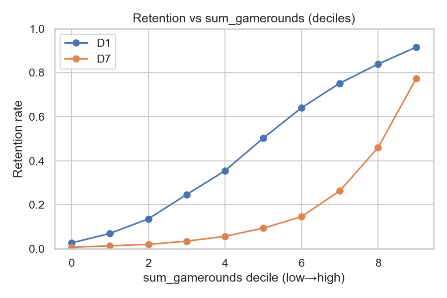

# Cookie Cats — EDA summary

- Rows: 90,189
- Columns: userid, version, sum_gamerounds, retention_1, retention_7
- D1 retention: 0.445
- D7 retention: 0.186
- Retention by version:
  - gate_30: D1=0.448, D7=0.190
  - gate_40: D1=0.442, D7=0.182

## Figures
- overall: 
- uplift_by_version: 
- retention_vs_gamerounds: 